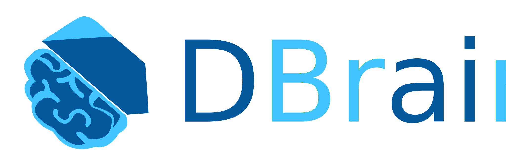

An end-to-end open source platform for machine learning.
# Introduction
`DBrain` is a Dart platform for training and deploying machine learning models.
`DBrain` provides:
 - A powerful N-dimensional array object
 - Useful linear algebra, Fourier transform, and random number capabilities
 -  Flexible ecosystem to build and deploy ML-powered applications.
 -  Easy to use visualization libraries
 
`BBrain` inspired by NumPy, the Python array programming library. Adaptors for existing data structures to be plugged into our expression system can easily be written,and Pytourch the open source machine learning framework based on the Torch library

## Usage

**Initialize a 2-D array and perform addition**

```Dart
 var tensor1 = Tensor<int>([
    [1, 2, 3],
    [4, 5, 6],
  ]);
  var tensor2 = Tensor<int>([
    [1, 2, 3],
    [4, 5, 6],
  ]);

  var sumWithScalar = tensor1 + 5;//or you can use tensor1.add method
  var sumWithTensor = tensor1 + tensor2;

  print(sumWithScalar.data);
  print(sumWithTensor.data);
```
Outputs:
```
[[6, 7, 8], [9, 10, 11]]
[[2, 4, 6], [8, 10, 12]]
```
**Initialize a 1-D array and reshape it inplace.**
```Dart
  var tensor1 = Tensor<double>([1.0, 2.5, 3.6, 5.0, 8.1, 9.4]);
  tensor1.reshape([2, 3]);

  print(tensor1.data);
```
Outputs:
```
[[1.0, 2.5, 3.6], [5.0, 8.1, 9.4]]
```
**Max or Min value**
```Dart
  var tensor = Tensor<double>([
    [
      [8.1, 9.4],
      [10.2, 11.0]
    ],
    [
      [8.1, 9.4],
      [10.2, 11.0]
    ]
  ]);

  print(tensor.max());
  print(tensor.min());
```
Outputs:
```
11.0
8.1
```

## License
[Apache License 2.0](https://github.com/mohamedlotfy50/dartML/blob/main/LICENSE)
